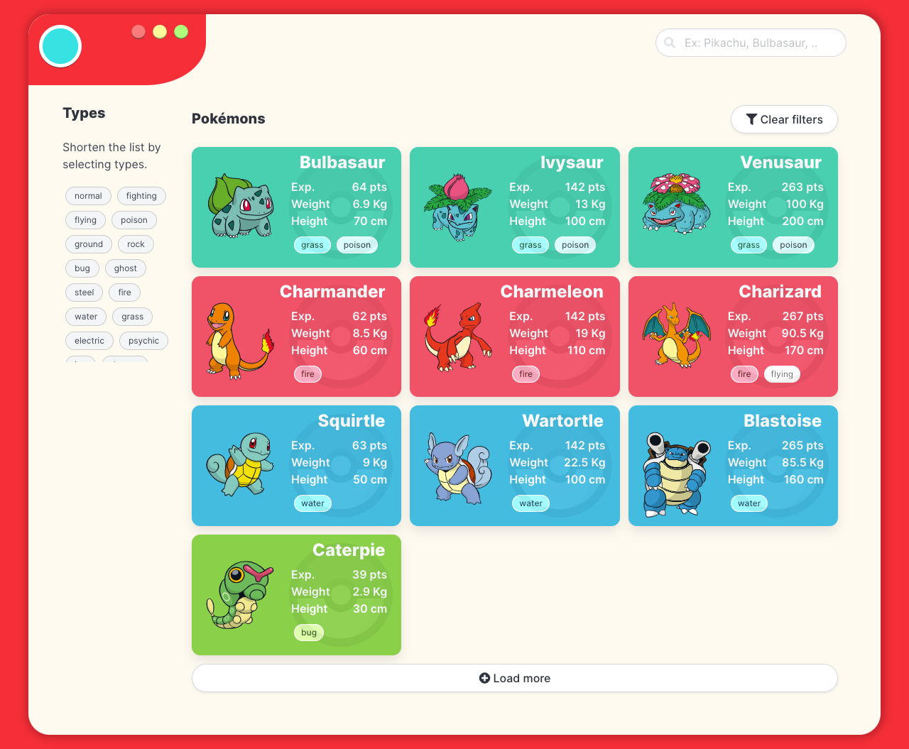
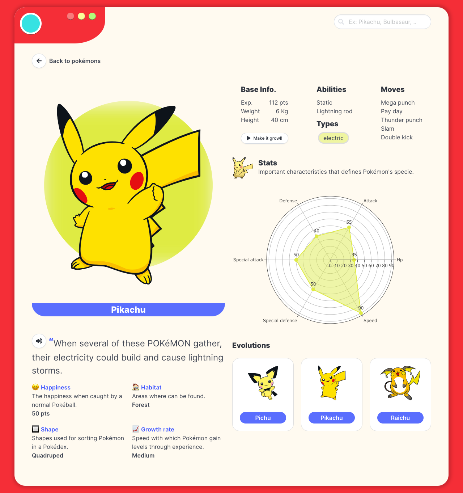

# My Pokédex PWA application

Proof of concept aimed at putting into practice Svelte as a technology.

> [!NOTE]  
> ❤️ Feel free to add any improvements or suggestions you consider.

1. [Goals](#001)
2. [Tech Stack](#002)
3. [Tech specs](#003)
4. [Installation and running the project](#004)
5. [Samples](#005)
6. [Next steps](#006)

<a name="001"></a>
### 🎯 Goals

-   Create an application **(PWA)** that displays Pokémons and its stats.
-   Integrate the **[The Pokémon API - PokéAPI](https://pokeapi.co/)** to the application.
- Use of **Plotly charts** to display stats.
-   Add the capability of listening to the Pokémon description using the **SpeechSynthesis API**.
-   Use browser's **LocalStorage** as a mean of data persistance.

#### Features
- Being able of installing the application on mobile devices / browser devices. **(PWA support)**.
- Get paginated resources by setting a **limit and an offset** criteria.
- Persist data by storing responses in browsers's LocalStorage. **Default time to live (TTL): 5 days.**
- Look for resources given an identifier (Pokémons given a name).
- Display stats using a **scatter polar chart**.
- Listen to the Pokémon's description by using the **SpeechSynthesis API**.

<a name="002"></a>
### Tech Stack

-   **Front-end**
    -   [Svelte](https://svelte.dev/)
    -   [Vite](https://vitejs.dev/)
    -   [SvelteKit Vite PWA](https://vite-pwa-org.netlify.app/)
    -   [Bulma CSS](https://bulma.io/)
-   **Charts**
    -   [Plotly JavaScript Open Source Graphing Library
](https://plotly.com/javascript/)
-   **Web APIs**
    -   [LocalStorage](https://developer.mozilla.org/en-US/docs/Web/API/Window/localStorage)
    -   [SpeechSynthesis](https://developer.mozilla.org/en-US/docs/Web/API/SpeechSynthesis)

<a name="003"></a>
### Tech specs

> From Sveltve+Vite default template

#### Svelte + Vite

This template should help get you started developing with Svelte in Vite.

#### Recommended IDE Setup

[VS Code](https://code.visualstudio.com/) + [Svelte](https://marketplace.visualstudio.com/items?itemName=svelte.svelte-vscode).

#### Need an official Svelte framework?

Check out [SvelteKit](https://github.com/sveltejs/kit#readme), which is also powered by Vite. Deploy anywhere with its serverless-first approach and adapt to various platforms, with out of the box support for TypeScript, SCSS, and Less, and easily-added support for mdsvex, GraphQL, PostCSS, Tailwind CSS, and more.

#### Technical considerations

**Why use this over SvelteKit?**

- It brings its own routing solution which might not be preferable for some users.
- It is first and foremost a framework that just happens to use Vite under the hood, not a Vite app.

This template contains as little as possible to get started with Vite + Svelte, while taking into account the developer experience with regards to HMR and intellisense. It demonstrates capabilities on par with the other `create-vite` templates and is a good starting point for beginners dipping their toes into a Vite + Svelte project.

Should you later need the extended capabilities and extensibility provided by SvelteKit, the template has been structured similarly to SvelteKit so that it is easy to migrate.

**Why `global.d.ts` instead of `compilerOptions.types` inside `jsconfig.json` or `tsconfig.json`?**

Setting `compilerOptions.types` shuts out all other types not explicitly listed in the configuration. Using triple-slash references keeps the default TypeScript setting of accepting type information from the entire workspace, while also adding `svelte` and `vite/client` type information.

**Why include `.vscode/extensions.json`?**

Other templates indirectly recommend extensions via the README, but this file allows VS Code to prompt the user to install the recommended extension upon opening the project.

**Why enable `checkJs` in the JS template?**

It is likely that most cases of changing variable types in runtime are likely to be accidental, rather than deliberate. This provides advanced typechecking out of the box. Should you like to take advantage of the dynamically-typed nature of JavaScript, it is trivial to change the configuration.

**Why is HMR not preserving my local component state?**

HMR state preservation comes with a number of gotchas! It has been disabled by default in both `svelte-hmr` and `@sveltejs/vite-plugin-svelte` due to its often surprising behavior. You can read the details [here](https://github.com/sveltejs/svelte-hmr/tree/master/packages/svelte-hmr#preservation-of-local-state).

If you have state that's important to retain within a component, consider creating an external store which would not be replaced by HMR.

```js
// store.js
// An extremely simple external store
import { writable } from 'svelte/store'
export default writable(0)
```

<a name="004"></a>
### Installation and running the project

The project requires:

-   [NodeJS](https://nodejs.org/)

**Clone the repository:**

```shell
git clone https://github.com/christianjtr/svelte-pokedex-pwa.git
```

**Scripts:**

Before executing these scripts, you must run **npm install** in the directory you just downloaded/cloned the codebase.

```shell
# Development mode
> npm run dev

# Build mode
> npm run build

# Others, refer to package.json file
# ...
```


<a name="005"></a>
### Samples

##### Live demo

Click on the following link [GitHub page project](https://christianjtr.github.io/svelte-pokedex-pwa). 

##### Preview


<p align="center">
    
</p>
    


##### Home page preview



##### Detail page preview


